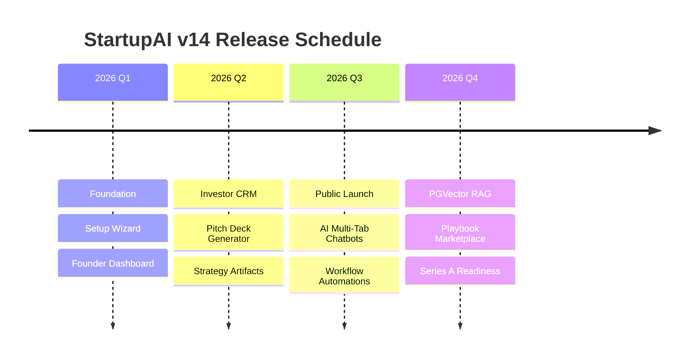

# StartupAI v14: Product Roadmap

**Status:** 🔵 Active Development  
**Last Updated:** January 13, 2026  
**Vision:** Establish the definitive operating system for early-stage founders.

---

## 1. Progress Tracker
| Phase | Focus | Status | % Complete |
| :--- | :--- | :--- | :--- |
| **Phase 0** | Infrastructure & Base UI | Done | 100% |
| **Phase 1** | The 6-Step Setup Wizard | In Progress | 40% |
| **Phase 2** | Founder Command Center | Todo | 0% |
| **Phase 3** | Investor Interface | Todo | 0% |
| **Phase 4** | Artifact Generation (PDF/Decks) | Todo | 0% |
| **Phase 5** | Public Beta & Launch | Todo | 0% |

---

## 2. Roadmap Timeline Summary

---

## 3. Detailed Phase Breakdown

### Phase 0: Foundation (Complete)
- **Infrastructure**: Supabase DB schema (46 tables) with RLS.
- **AI Core**: Gemini SDK integration and `process.env` key securement.
- **UI Architecture**: Three-Panel Layout and Stone/Editorial design system.
- **Routing**: HashRouter implementation for static environments.

### Phase 1: Startup Wizard (Active)
- **Goal**: Transition from "Idea" to "Data-Grounded Profile."
- **Milestone 1.1**: Step 1-3 (Basics, Narrative, Business Model).
- **Milestone 1.2**: Step 4-6 (Metrics, Fundraising, Strategy Locking).
- **AI Deliverable**: `wizard-step-1-extract` (URL reading agent).

### Phase 2: Founder Command Center (Q1 Target)
- **Goal**: Daily operational execution.
- **Features**: 
    - Next Best Action (NBA) logic engine.
    - Real-time runway/burn rate visualizers.
    - Context-aware AI Intelligence panel (The 3-Question Framework).

### Phase 3: Relationship CRM (Q2 Target)
- **Goal**: Managing capital and customer pipelines.
- **Features**:
    - Kanban-style Deal Pipeline.
    - Investor Research Agent (Google Search Grounding).
    - Automated follow-up suggestion engine.

### Phase 4: Artifact Generation (Q2 Target)
- **Goal**: Investor-ready exportable assets.
- **Features**:
    - AI Pitch Deck (12 slides, editable).
    - Executive Strategy PDF.
    - Interactive Lean Canvas grid.

---

## 4. Technical Dependencies & Risks

### Critical Path Dependencies
1. **Wizard Completion**: Dashboard insights cannot generate without a locked Startup Profile.
2. **Edge Function Deployments**: AI Agents (Analyst/Research) require Deno runtime stability.
3. **Google Search Quotas**: Heavy investor discovery usage may hit search API limits.

### Risk Mitigation
- **Hallucination Control**: Use Gemini 3 Thinking mode for reasoning and strict JSON schemas for UI mapping.
- **Latency**: Implement skeleton states for AI "Thinking" cycles (approx 5-10s for deep reasoning).
- **Data Privacy**: Enforce RLS at the Postgres level so founders can never see competitor data.

---

## 5. Success Metrics (KPIs)
- **Time to Clarity**: New users should have a strategy document in < 25 minutes.
- **NBA Adoption**: % of users who click the "AI Suggested Action" within 24 hours of generation.
- **Deck Export Rate**: Total number of pitch decks generated that result in a PDF export.

---

**End of Roadmap Document**