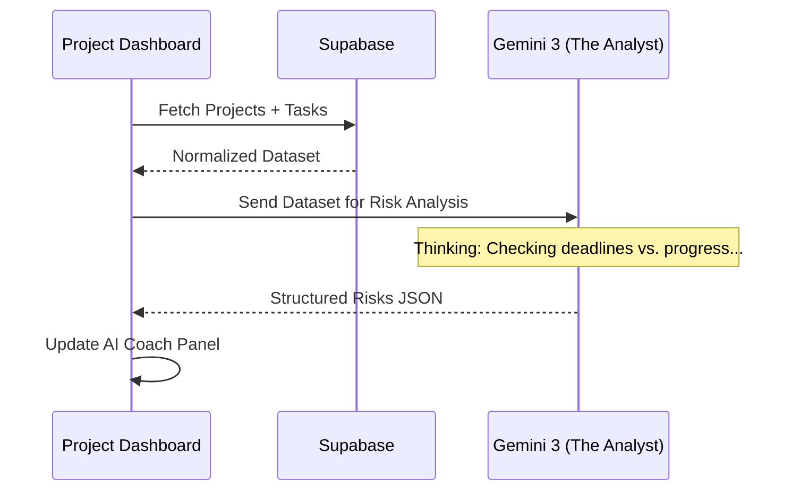

# Implementation Plan: Project Overview Dashboard (/app/projects)

This document defines the execution strategy for the Projects Screen, transforming operational data into a structured, risk-aware oversight interface.

---

## 1. Progress Tracker

| Feature / Screen | Status | % Complete | Priority |
| :--- | :--- | :--- | :--- |
| **Three-Panel Layout Integration** | Done | 100% | P0 |
| **Summary Metrics Row** | Todo | 0% | P1 |
| **Project List (Editorial Cards)** | Todo | 0% | P0 |
| **Project Health & Risk Analyst** | Todo | 0% | P0 |
| **Milestone Planner Agent** | Todo | 0% | P1 |
| **Timeline / Gantt View (Phase 2)** | Todo | 0% | P2 |

---

## 2. Feature & Screen Breakdown

### Feature: Project List View (Main Panel)
- **Purpose**: High-level tracking of active initiatives.
- **User Goal**: See status, progress, and team ownership across all active workstreams.
- **System Goal**: Aggregate task completion data into visual progress indicators.
- **Inputs**: `projects` table, `tasks` (joined), user metadata.
- **Outputs**: Sortable list of project cards with relative timestamps and progress bars.

### Feature: Strategic Metrics Row (Main Panel)
- **Purpose**: Quantify operational velocity.
- **User Goal**: Immediate understanding of "Are we on track?" across the board.
- **System Goal**: Dynamic calculation of average completion and risk density.
- **Inputs**: Global project/task state.
- **Outputs**: 4 Stone-palette cards (Overall Completion, Active, At Risk, Tasks Done).

### Feature: AI Coach - Risk & Recommendation (Right Panel)
- **Purpose**: Proactive bottleneck detection.
- **User Goal**: Identify hidden risks (e.g., stagnant tasks) before they block milestones.
- **System Goal**: Run heuristic and LLM analysis on project timelines.
- **Inputs**: Project deadlines + Task update frequency + Startup runway.
- **Outputs**: Actionable insights (e.g., "Timeline Risk Detected").

---

## 3. Multi-Step PROMPTS

### Multi-Step Prompt: Project Health & Risk Analyst

**Step 1 – Context Setup**
- **Receive**: JSON array of `projects` (ID, name, deadline, status) and `tasks` (status, due_date, last_updated, priority).
- **Constraints**: Focus on identifying "Stalled" projects (no activity in 72h) and "At Risk" deadlines.

**Step 2 – Analysis / Reasoning**
- **Logic**: 
  - Compare `total_tasks` vs `completed_tasks`. 
  - If `progress < 50%` and `deadline < 14 days`, mark as **CRITICAL**.
  - Check for "Task Orphans" (tasks with no assigned owner).

**Step 3 – Generation**
- **Output**: Structured JSON:
  ```json
  {
    "overall_health_score": 0-100,
    "at_risk_count": number,
    "insights": [
      { "type": "warning", "title": "Stagnant Initiative", "message": "Project X has seen no updates in 4 days.", "urgency": "high" }
    ],
    "recommendations": ["Assign a lead to Project Y", "Reschedule Task Z"]
  }
  ```

**Step 4 – Validation**
- **Check**: Ensure `overall_health_score` is mathematically derived from progress percentages. Ensure insights map directly to specific Project IDs.

**Step 5 – Next Actions**
- **Trigger**: Update `projects.health_status` in DB. Refresh Right Panel UI.

---

### Multi-Step Prompt: Project Milestone Planner

**Step 1 – Context Setup**
- **Receive**: `project_name`, `category` (e.g., GTM, Seed Prep, Product), and `startup_profile` (problem/solution).
- **Goal**: Generate a standard but tailored task list.

**Step 2 – Analysis / Reasoning**
- **Logic**: Match the project category against industry standard "Success Paths" (e.g., YC's Guide to Seed Fundraising).
- **Constraint**: Max 8 high-level tasks to avoid overwhelm.

**Step 3 – Generation**
- **Output**: Structured JSON:
  ```json
  {
    "suggested_milestones": [
      { "title": "Initial Draft", "tasks": ["Task 1", "Task 2"], "estimated_days": 5 }
    ]
  }
  ```

**Step 4 – Validation**
- **Check**: Tasks must be actionable (start with a verb). Timelines must fit within 3 months unless specified.

**Step 5 – Next Actions**
- **Trigger**: Present as "AI Suggestions" in a modal for user approval before DB insertion.

---

## 4. Task Matrix

| Task | Prompt-Driven? | Type | Complexity | Blocking |
| :--- | :--- | :--- | :--- | :--- |
| Risk Analyst Implementation (Thinking) | Yes | AI | High | Yes |
| Editorial Project Card Component | No | UI | Medium | No |
| Progress Calculation (Aggregates) | No | Data | Medium | Yes |
| Real-time Activity Feed Sub | No | Backend | Medium | No |
| Milestone Planner Modal | Yes | UI/AI | Medium | No |

---

## 5. Gemini 3 Features & Tools

| Feature | Model | Why Required |
| :--- | :--- | :--- |
| **Thinking Mode** | Gemini 3 Pro | To reason across multiple project timelines and detect complex resource bottlenecks (e.g., "Founder is over-leveraged"). |
| **Structured Output** | Gemini 3 Pro | Mandatory for reliable mapping of risk insights to specific UI badges/cards. |
| **Code Execution** | Gemini 3 Flash | To run precise math on completion rates and runway-vs-deadline projections. |

---

## 6. AI Agents

| Agent Name | Responsibility | Input | Output Example |
| :--- | :--- | :--- | :--- |
| **The Analyst** | Health Scoring & Risk Detection | Project + Task JSON | `{"health": 64, "risks": ["Deadline collision"]}` |
| **The Planner** | Milestone & Task Generation | Project Title + Context | `[{"milestone": "MVP", "tasks": ["Auth", "UI"]}]` |

---

## 7. Success Criteria & Production Checklist
- [ ] List View renders < 300ms.
- [ ] Progress bars reflect actual task completion percentage.
- [ ] Clicking a project navigates to the unique ID route.
- [ ] AI Insights refresh automatically when a task is completed.
- [ ] Error boundary handles failed Gemini calls gracefully with fallback advice.

---

## 8. Mermaid Diagrams

### Data Flow: Project State to AI Insight


---

## 9. Gaps, Risks & Missing Logic
- **Stale Context**: If the user updates a task, the AI Analyst needs a trigger to re-evaluate health immediately.
- **Logic Mapping**: How "Health Score" (0-100) translates to Status Colors (Emerald/Amber/Rose) needs a strict client-side mapping.
- **Task Granularity**: AI might suggest tasks that are too broad ("Build Product"). Prompt must enforce "Actionable/Granular" granularity.