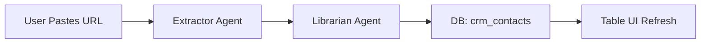

# Implementation Plan: Contacts Management (/app/contacts)

## 1. Progress Tracker
| Feature / Screen | Status | % Complete | Priority |
| :--- | :--- | :--- | :--- |
| Contacts Table UI | Todo | 0% | P0 |
| LinkedIn Import Agent | Todo | 0% | P0 |
| Profile Enrichment | Todo | 0% | P1 |
| Interaction Logging | Todo | 0% | P2 |

## 2. Screen Overview
- **Description**: Central hub for all external relationships (Investors, Customers, Partners).
- **Purpose**: Organize and enrich contacts automatically.
- **User Goal**: Import contacts from LinkedIn and have AI "fill in the blanks" regarding their background.
- **System Goal**: Build a graph of relationships with enriched metadata.
- **Success Criteria**: Zero-effort contact enrichment via URL.

## 3. Features
- Filtered tabs (All, Sales, Investor, LinkedIn).
- "Enrich from LinkedIn" button for single or bulk actions.
- Full-text search across role, company, and bio.

## 4. Content & Data
- **User Inputs**: Name, Email (optional), LinkedIn URL.
- **AI Inputs**: Raw LinkedIn profile text, Company website.
- **Data Read**: `crm_contacts`, `ai_runs`.
- **Data Written**: `crm_contacts`.
- **Outputs**: Enriched Profiles, Type categorization (e.g., "Tier 1 VC").

## 5. Multi-Step PROMPT TASKS

#### Multi-Step Prompt: Contact Extractor Agent
**Step 1 – Context**
- Receives: Raw text pasted from a LinkedIn profile or a URL.
- Constraints: Must identify "Current Role" vs "Previous Roles" correctly.

**Step 2 – Analysis**
- Reason about "Professional Archetype": Is this a Buyer, an Investor, or a Partner?
- Infer "Warm Intro Points" (Common universities, past companies).

**Step 3 – Generation**
- Produces: JSON object.
- Format: `{"name": "", "role": "", "company": "", "archetype": "", "bio": ""}`.

**Step 4 – Validation**
- Verify names aren't generic (e.g., "LinkedIn User").

**Step 5 – Next Actions**
- Trigger: Suggest a Deal stage if archetype is "Investor".

## 6. Task Matrix
| Task | Prompt-Driven | Type | Complexity | Blocking |
| :--- | :--- | :--- | :--- | :--- |
| Table with Sorting | No | UI | Low | Yes |
| Extractor Agent | Yes | AI | Medium | Yes |
| Search Engine (Fuse.js) | No | UI/Data | Low | No |
| Bulk Import Modal | No | UI | Medium | No |

## 7. Gemini 3 Features & Tools
- **Model**: Gemini 3 Flash.
- **Features**: 
    - **URL Context**: Directly reading profile data.
    - **Structured Output**: Ensuring valid JSON for database insertion.

## 8. AI Agents
- **Extractor Agent**: Turns unstructured profile text into structured contact rows.
- **Librarian Agent**: Categorizes contacts into segments for filtering.

## 9. Mermaid Diagrams

## 10. Production-Ready Checklist
- [ ] Table supports pagination for 100+ contacts.
- [ ] Type badges are color-coded (Stone theme).
- [ ] LinkedIn enrichment handles partial data gracefully.

## 11. Risks & Gaps
- **Auth Walls**: AI might not be able to crawl LinkedIn profiles behind login; fallback to user-pasted text required.
