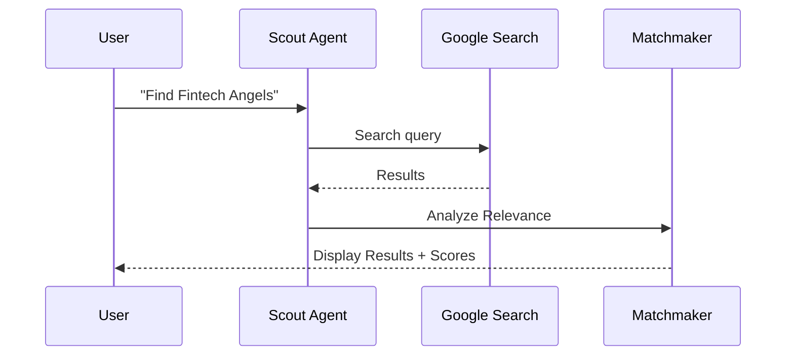

# Implementation Plan: Contact Discovery (/app/discovery)

## 1. Progress Tracker
| Feature / Screen | Status | % Complete | Priority |
| :--- | :--- | :--- | :--- |
| Discovery Search Bar | Todo | 0% | P0 |
| Prospecting Scout Agent | Todo | 0% | P0 |
| Matchmaker Analysis | Todo | 0% | P1 |
| "Add to CRM" Workflow | Todo | 0% | P1 |

## 2. Screen Overview
- **Description**: A natural language search engine to find new leads and investors.
- **Purpose**: Proactively find people who should be in the founder's CRM but aren't.
- **User Goal**: Ask "Find seed VCs in SF focused on Fintech" and get a qualified list.
- **System Goal**: Turn natural language intent into live web search results + fit scoring.
- **Success Criteria**: Relevance of top 5 results > 80%.

## 3. Features
- Natural language query interface.
- "Fit Analysis" explaining *why* a prospect was suggested.
- One-click import to Contacts/CRM.

## 4. Content & Data
- **User Inputs**: NL Query (e.g., "Seed investors in NY").
- **AI Inputs**: Query, Startup Profile (for context matching).
- **Data Read**: `startup_profile`, `google_search`.
- **Data Written**: `crm_contacts` (on import).
- **Outputs**: List of Prospects, Match Logic Breakdown.

## 5. Multi-Step PROMPT TASKS

#### Multi-Step Prompt: Prospecting Scout Agent
**Step 1 – Context**
- Receives: NL Query + Startup Context.
- Constraints: Max 10 results per search. Use `googleSearch`.

**Step 2 – Analysis**
- Thinking Mode: Breakdown the query into keywords. If "Fintech", search for "Top fintech funds", "Fintech angel list", "Recent fintech seed news".
- Cross-reference found entities against the `StartupProfile`.

**Step 3 – Generation**
- Produces: List of Objects.
- Format: `[{"name": "", "source": "", "match_score": 0, "why_match": ""}]`.

**Step 4 – Validation**
- Filter out dead links or irrelevant service providers (e.g., Law firms when looking for VCs).

**Step 5 – Next Actions**
- Trigger: User chooses to "Enrich" a specific prospect.

## 6. Task Matrix
| Task | Prompt-Driven | Type | Complexity | Blocking |
| :--- | :--- | :--- | :--- | :--- |
| NL Search UI | No | UI | Low | Yes |
| Scout Agent Logic | Yes | AI | High | Yes |
| Matchmaker Logic | Yes | AI | Medium | No |
| CRM Integration | No | Backend | Low | No |

## 7. Gemini 3 Features & Tools
- **Model**: Gemini 3 Pro.
- **Features**: 
    - **Google Search**: Fundamental for "Discovery" (external data).
    - **Thinking**: Needed to judge if a prospect's "Thesis" matches the founder's "Industry".

## 8. AI Agents
- **Scout Agent**: Performs the heavy lifting of searching and entity extraction.
- **Matchmaker Agent**: Explains the connection between the prospect and the startup.

## 9. Mermaid Diagrams

## 10. Production-Ready Checklist
- [ ] Search input handles "Enter" key and loading states.
- [ ] Results show "Verified" badges for known entities.
- [ ] Right panel shows the "Analysis" only when a result is clicked.

## 11. Risks & Gaps
- **Search Quotas**: Heavy use might hit API limits.
- **Context Drift**: Ensure the AI remembers the startup is "Seed" even if the query is broad.
