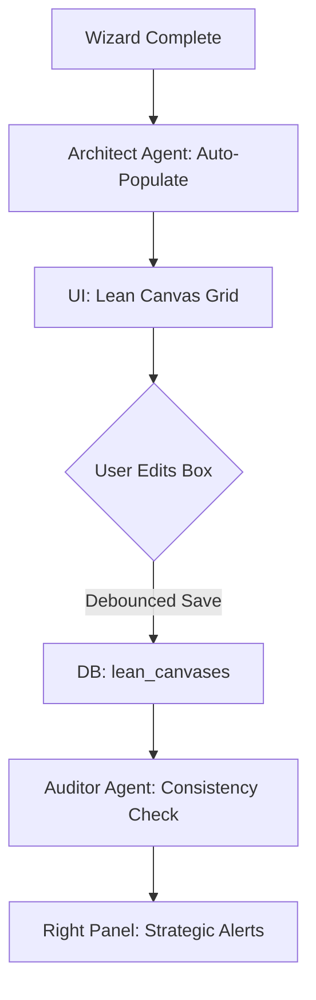
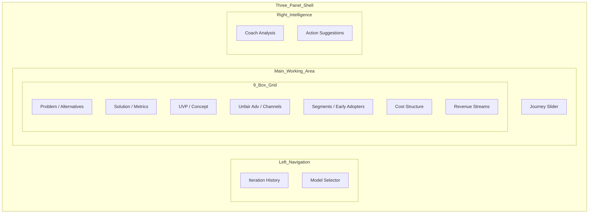

# Implementation Plan: Lean Canvas Grid (/app/lean-canvas)

## 1. Progress Tracker
| Feature / Screen | Status | % Complete | Priority |
| :--- | :--- | :--- | :--- |
| Visual Canvas Grid (Editorial) | Done | 100% | P0 |
| Inline Block Editor | Done | 100% | P0 |
| AI Block Suggestion Agent | Done | 100% | P1 |
| AI Canvas Reviewer (Consistency) | Done | 100% | P1 |
| Builder Journey Navigation | Done | 100% | P2 |
| PDF / Image Export | Todo | 0% | P2 |

## 2. Screen Overview
- **Description**: A high-fidelity, interactive 9-box Lean Canvas implementation designed for strategic clarity.
- **Purpose**: To provide a visual mental model of the business that aligns problem-solution fit with unit economics.
- **User Goal**: Rapidly map and refine the business model on a single screen without writing long-form docs.
- **System Goal**: Use AI to ensure internal consistency between blocks (e.g., does the Solution actually address the Problem?).
- **Success Criteria**: A completed, consistent canvas generated or refined in <15 minutes.

## 3. Features
- **3-Column Editorial Grid**: Classic Lean Canvas layout with a stone-palette aesthetic, prioritizing readability and structural symmetry.
- **Inline Editing**: Click-to-edit text blocks with debounced auto-save functionality to the `lean_canvases` table.
- **AI "Magic" Assist**: Strategic support buttons on each block to generate high-quality suggestions or polish existing drafts.
- **Builder Journey Slider**: Contextual bottom navigation showing the founder's progression through the startup lifecycle (Profile -> Canvas -> Deck -> GTM).
- **Consistency Auditor**: Proactive right-panel analysis identifying logical gaps or contradictions between business model components.

## 4. Content & Data
- **User Inputs**: Text content for all 9 boxes (Problem, Solution, UVP, Unfair Advantage, Customer Segments, Channels, Key Metrics, Cost Structure, Revenue Streams).
- **AI Inputs**: `StartupProfile` context, current canvas state, competitor landscape data fetched via Google Search.
- **Data Read**: `lean_canvases` table, `startup_profile` table.
- **Data Written**: `lean_canvases` table (versioned snapshots).
- **Outputs**: Interactive grid UI, strategic intelligence reports, exportable PDF assets.

## 5. Multi-Step PROMPT TASKS

### Multi-Step Prompt: The Business Model Architect (Canvas Generation)
**Step 1 – Context**
- **Input**: Full `StartupProfile` data (Industry, Problem, Solution, Traction, Capital Goals).
- **Constraints**: Map extracted data to the 9 Lean Canvas blocks. Use high-leverage business terminology (e.g., LTV, CAC, Moat).

**Step 2 – Analysis**
- **Logic**: Verify the "Unique Value Proposition" (UVP) directly addresses the "Problem" and leverages the "Solution."
- **Thinking**: Evaluate if the "Cost Structure" and "Revenue Streams" are sustainable for the specific industry vertical using a thinking budget of 4000 tokens.

**Step 3 – Generation**
- **Output**: Structured JSON object matching the `LeanCanvas` domain interface.
- **Format**: `{"problem": [], "solution": [], "uvp": "", "unfairAdvantage": "", ...}`.

**Step 4 – Validation**
- **Check**: Ensure all blocks have at least one valid entry. Confirm the "High-Level Concept" follows the "X for Y" analogy pattern.

### Multi-Step Prompt: The Strategic Auditor (Canvas Review)
**Step 1 – Context**
- **Input**: The current `LeanCanvas` JSON state.
- **Goal**: Identify logical contradictions (e.g., high-touch sales channel paired with low-margin revenue streams).

**Step 2 – Analysis**
- **Logic**: Perform "Vertical Threading":
  - Does the Solution resolve the stated Problems?
  - Do the Key Metrics measure the success of the Solution?
  - Is the Unfair Advantage actually defensible against identified competitors?
- **Thinking**: Use an 8000-token thinking budget to simulate a VC's critical review.

**Step 3 – Generation**
- **Output**: Strategic insight report for the Right Panel.
- **Format**: `{"meaning": "analysis", "action": "recommended fix", "urgency": "high|med|low"}`.

**Step 4 – Next Actions**
- **Trigger**: Flag specific grid boxes in the UI that require immediate founder attention.

## 6. Task Matrix
| Task | Prompt-Driven | Type | Complexity | Blocking |
| :--- | :--- | :--- | :--- | :--- |
| CSS Grid Layout (Editorial) | No | UI | Medium | Yes |
| Inline Block Editor & State | No | UI | Medium | Yes |
| Architect Agent Implementation | Yes | AI | High | No |
| Strategic Auditor Logic | Yes | AI | High | No |
| Builder Journey Integration | No | UI | Low | No |
| PDF Export Engine | No | Data | High | No |

## 7. Gemini 3 Features & Tools
| Feature | Model | Why Required |
| :--- | :--- | :--- |
| **Thinking Mode** | Gemini 3 Pro | Necessary for the Auditor Agent to reason through complex business interdependencies and detect subtle strategy flaws. |
| **Google Search** | Gemini 3 Pro | Vital for the Architect Agent to identify "Existing Alternatives" based on current market data. |
| **Structured Output** | Gemini 3 Flash | Essential for parsing generated canvas blocks directly into the application state without errors. |

## 8. AI Agents
| Name | Responsibility | Input | Output |
| :--- | :--- | :--- | :--- |
| **The Architect** | Translates raw founder ideas into a structured, consistent Lean Canvas. | Startup Profile + User Edits | `LeanCanvas` JSON |
| **The Auditor** | Detects strategic gaps and model contradictions. | Full Canvas State | Risk Report + Urgency |

## 9. Mermaid Diagrams

### Canvas Data Lifecycle

### Wireframe Layout

## 10. Production-Ready Checklist
- [ ] Responsive grid logic (3-col desktop, 1-col mobile).
- [ ] 1000ms debounce on all text inputs.
- [ ] Context-aware help tooltips for each box definition.
- [ ] Visual indicator for "AI Refined" blocks.
- [ ] Logical validation: Prevent saving if UVP is empty.

## 11. Risks & Gaps
- **UI Overflow**: Long lists in a single box can break the editorial grid; require "line-clamp" or internal scrolling.
- **Context Drift**: Ensure the AI remembers the "Industry" context when suggesting metrics to avoid generic advice.
- **Export Formatting**: Ensuring the PDF maintains the "Stone" aesthetic and grid structure.
