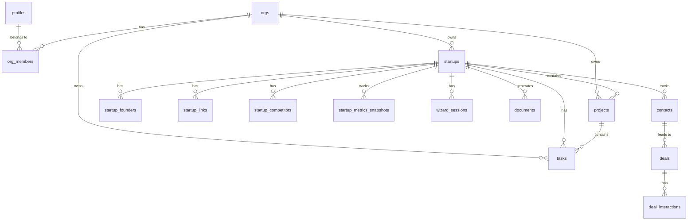
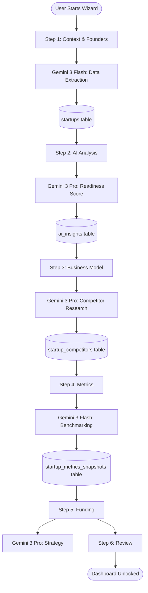
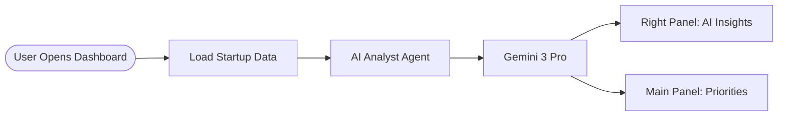
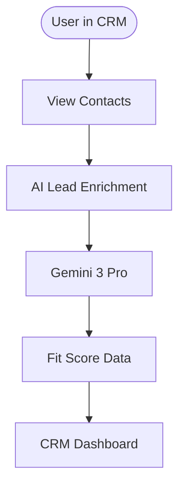
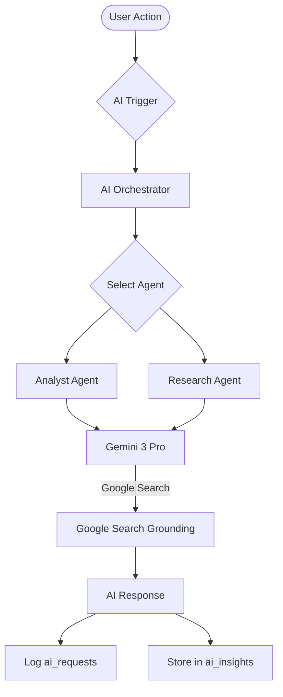

# StartupAI Database Diagrams

**Last Updated:** January 13, 2026  
**Purpose:** Visual representation of database structure, relationships, and data flows  

---

## 1. Entity Relationship Diagram (ERD)

---

## 2. Data Flow Diagrams

### 2.1 Wizard Data Flow (6 Steps)

### 2.2 Dashboard Data Flow

### 2.3 CRM Data Flow

---

## 3. AI Data Flow

---

## 4. Usage Guide

| Diagram | Use Case | Audience |
|---------|----------|----------|
| **ERD** | Understanding table relationships | Developers |
| **Wizard Flow** | Debugging setup sequence | Developers, QA |
| **AI Data Flow** | AI integration & model selection | AI Engineers |

---

**Keep diagrams updated as schema evolves. Use these for onboarding and architecture discussions.**