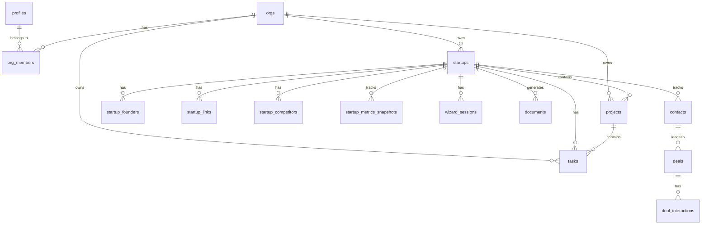

# Supabase Tables Schema

**Last Updated:** January 13, 2026  
**Status:** 🟢 Active  
**Total Tables:** 46 core tables (45 existing + 1 projects)

---

## Core Tables Overview

### Identity & Organization

**`profiles`**
- User profile information
- Columns: `id`, `email`, `full_name`, `avatar_url`, `created_at`, `updated_at`

**`orgs`**
- Organizations (companies)
- Columns: `id`, `name`, `slug`, `created_at`, `updated_at`

**`org_members`**
- Organization membership
- Columns: `id`, `org_id`, `user_id`, `role`, `created_at`

---

### Startup Data

**`startups`**
- Main startup information
- Columns: `id`, `org_id`, `name`, `description`, `industry`, `stage`, `website_url`, `created_at`, `updated_at`

**`startup_founders`**
- Founder team members
- Columns: `id`, `startup_id`, `name`, `role`, `linkedin_url`, `bio`, `created_at`

**`startup_links`**
- External links (website, blog, press)
- Columns: `id`, `startup_id`, `url`, `link_type`, `created_at`

**`startup_competitors`**
- Competitor information
- Columns: `id`, `startup_id`, `name`, `url`, `notes`, `created_at`

**`startup_metrics_snapshots`**
- Historical metrics tracking
- Columns: `id`, `startup_id`, `metric_type`, `value`, `date`, `created_at`

---

### Wizard & Documents

**`wizard_sessions`**
- Wizard progress tracking
- Columns: `id`, `user_id`, `startup_id`, `current_step`, `data`, `completed_at`, `created_at`

**`documents`**
- Generated documents (strategy, pitch deck, etc.)
- Columns: `id`, `startup_id`, `document_type`, `title`, `content`, `created_at`, `updated_at`

---

### CRM & Contacts

**`contacts`**
- Investor and customer contacts
- Columns: `id`, `org_id`, `name`, `email`, `company`, `role`, `tags`, `created_at`, `updated_at`

**`deals`**
- Deal pipeline
- Columns: `id`, `org_id`, `contact_id`, `startup_id`, `stage`, `value`, `probability`, `created_at`, `updated_at`

**`deal_interactions`**
- Interaction history
- Columns: `id`, `deal_id`, `interaction_type`, `notes`, `date`, `created_at`

---

### Tasks & Projects

**`tasks`**
- Task management
- Columns: `id`, `org_id`, `startup_id`, `title`, `description`, `priority`, `status`, `due_date`, `created_at`, `updated_at`

**`projects`**
- Operational projects
- Columns: `id`, `org_id`, `startup_id`, `name`, `description`, `status`, `start_date`, `target_end_date`, `progress_percent`, `created_at`, `updated_at`

---

### Pitch Decks

**`pitch_decks`**
- Pitch deck metadata
- Columns: `id`, `startup_id`, `title`, `template`, `slide_count`, `created_at`, `updated_at`

**`pitch_deck_slides`**
- Individual slides
- Columns: `id`, `deck_id`, `slide_number`, `slide_type`, `title`, `content`, `image_url`, `created_at`, `updated_at`

---

### AI & Analytics

**`ai_requests`**
- AI request logging
- Columns: `id`, `user_id`, `request_type`, `model`, `tokens_used`, `response_time`, `created_at`

**`ai_insights`**
- Stored AI insights
- Columns: `id`, `startup_id`, `insight_type`, `content`, `priority`, `created_at`

---

## Entity Relationship Diagram (ERD)

---

## Key Indexes

**Foreign Keys:**
- `startups.org_id` → `orgs.id`
- `startup_founders.startup_id` → `startups.id`
- `contacts.org_id` → `orgs.id`
- `deals.contact_id` → `contacts.id`
- `tasks.startup_id` → `startups.id`
- `projects.startup_id` → `startups.id`

---

## Row Level Security (RLS)

All tables have RLS enabled:
- Users can only access their own organization's data.
- Policies check `org_id` membership against the `org_members` table.

---

**Keep it simple. Focus on core tables. Add complexity only when needed.**